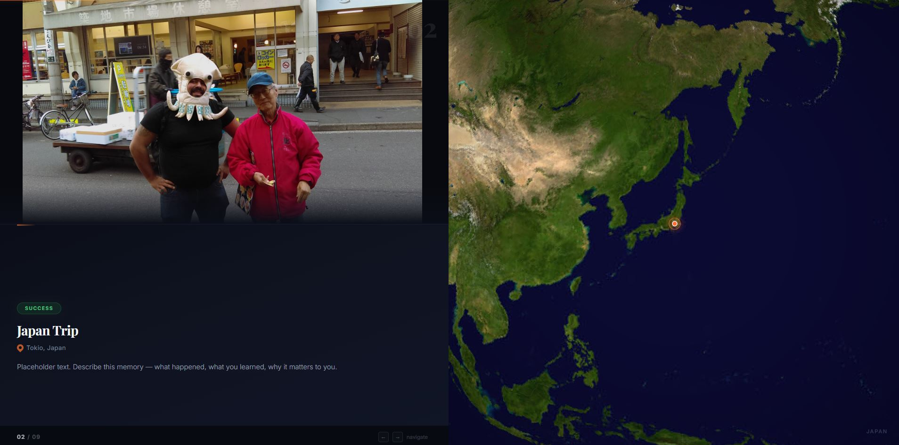

# Conexion — Life Memories Globe

An interactive single-page presentation that showcases personal life memories — both failures and successes — tied to geographic locations around the world. Each slide combines a photo, narrative text, and a smoothly animated 3D globe that rotates to the memory's location.



## Features

- **Interactive 3D Globe** — A textured Earth rendered on HTML5 Canvas using D3.js orthographic projection with realistic atmosphere, country borders, and location markers
- **Smooth Globe Animation** — On each slide change, the globe zooms out, rotates to the new location, and zooms back in with eased cubic/quadratic transitions
- **Photo Slideshow** — Crossfade transitions between personal photos with CSS opacity animations
- **Narrative Text Panel** — Each slide displays a title, geographic location with a pin icon, a success/failure badge, and narrative text
- **Keyboard Navigation** — Use `←` / `→` arrow keys to move between slides, with smart cooldown that adapts to whether the globe needs to rotate
- **Progress Bar** — A thin gradient progress bar at the top tracks your position through the presentation
- **Star Field Background** — Procedurally generated twinkling stars behind the globe for an immersive space aesthetic
- **Zero Build Tools** — Everything runs from a single HTML file with CDN-loaded libraries; no npm, no bundler, no framework

## Screenshot

The presentation uses a split-screen layout:
- **Left half**: Photo on top, text panel on bottom (title, location, narrative, success/failure badge)
- **Right half**: Animated 3D globe with location marker, atmosphere glow, and starfield background

## Tech Stack

| Technology | Purpose |
|---|---|
| **HTML5 Canvas** | Globe rendering with pixel-level earth texture mapping |
| **D3.js v7** | Orthographic projection, geo-path rendering, geographic calculations |
| **TopoJSON** | Efficient country boundary data (110m resolution) |
| **CSS3** | Transitions, gradients, backdrop-filter, layout |
| **Vanilla JavaScript** | All interactivity, animation loop, keyboard handling |
| **Google Fonts** | Playfair Display (headings) + Inter (body text) |

## File Structure

```
conexion-life-globe/
├── index.html              # Main application (single-file, self-contained)
├── world-data.js           # TopoJSON world boundaries (inlined as JS)
├── earth-texture-data.js   # Earth satellite texture (base64-encoded)
├── earth-texture.jpg       # Earth texture source image
├── earth-texture-b64.txt   # Base64-encoded texture (intermediate artifact)
├── countries-110m.json     # TopoJSON source data
├── screenshot.jpg          # Application screenshot
├── CLAUDE.md               # AI assistant project context
├── README.md               # This file
├── img_generics/           # Generic placeholder images (included in repo)
│   └── *.jpg / *.webp
└── img/                    # Personal photos (NOT included — see below)
    └── *.jpg
```

## About the Images

**Personal photos are not included in this repository** for privacy reasons. The `img/` folder is listed in `.gitignore` and is not tracked by git.

The repository ships with an `img_generics/` folder containing generic placeholder images so you can see the presentation working out of the box. The slide data in `index.html` references paths in `img/` — to run the presentation with the original photos, you would need to provide your own images in that folder matching the filenames in the `slides` array.

To use the generic placeholders instead, simply update the `img` field in each slide entry inside `index.html` to point to files in `img_generics/`.

## How It Works

### Globe Rendering Pipeline

1. **Earth Texture**: A satellite image of Earth is base64-encoded and loaded into an offscreen canvas
2. **Pixel Mapping**: For each visible pixel on the globe sphere, the orthographic projection is inverted to get lat/lng coordinates, which are then mapped to the texture's pixel data
3. **Country Borders**: TopoJSON country boundaries are drawn over the texture using D3's `geoPath`
4. **Atmosphere Effects**: Multiple radial gradients simulate atmospheric glow — an outer haze, inner rim lighting, and a thin atmosphere ring
5. **Location Marker**: An animated orange dot with glow effect marks the current slide's location (only visible when on the front-facing hemisphere)

### Slide Transition Sequence

When navigating between slides:

1. **Text Panel**: Fades out (350ms), content updates, fades back in
2. **Photo**: CSS crossfade transition (1.2s cubic-bezier easing)
3. **Globe Animation** (three phases):
   - **Zoom Out** (700ms) — Globe shrinks from 1.8x to 1x scale
   - **Rotate** (1400ms) — Globe rotates from current location to new location using D3 interpolation
   - **Zoom In** (700ms) — Globe grows back to 1.8x scale
4. **Navigation Cooldown**: 2.9s for location changes, 0.9s for same-location slides

### Slide Data

Each slide is defined as a JavaScript object:

```js
{
  img: "img/photo.jpg",       // Photo path
  title: "Memory Title",      // Display title
  location: "City, Country",  // Location label
  lat: 19.4326,               // Latitude
  lng: -99.1332,              // Longitude
  type: "success",            // "success" or "failure" badge
  text: "Narrative text..."   // Story/description
}
```

## Locations Featured

The presentation spans multiple countries and continents:

| Location | Country |
|---|---|
| Mexico City | Mexico |
| Istmo de Tehuantepec | Mexico |
| Real del Monte, Hidalgo | Mexico |
| Guadalajara, Jalisco | Mexico |
| Tokyo | Japan |
| Shanghai | China |
| Chicago, Illinois | USA |

## Getting Started

### Quick Start

1. Clone the repository:
   ```bash
   git clone https://github.com/jmtoral/conexion-life-globe.git
   cd conexion-life-globe
   ```

2. Open `index.html` in a modern web browser:
   ```bash
   # macOS
   open index.html

   # Linux
   xdg-open index.html

   # Windows
   start index.html
   ```

3. Use `←` and `→` arrow keys to navigate between slides.

### Requirements

- A modern web browser with HTML5 Canvas support (Chrome, Firefox, Safari, Edge)
- Internet connection on first load (for Google Fonts and D3.js/TopoJSON CDN scripts)
- Desktop/laptop screen recommended (not optimized for mobile)

### No Build Step Required

There is nothing to install or compile. The project is entirely self-contained — just open the HTML file and go.

## Customization

### Adding or Editing Slides

Edit the `slides` array inside `index.html` (starts around line 366). Each entry follows the slide data structure shown above. Add your own photos to the `img/` folder (or `img_generics/`) and reference them in the `img` field.

### Changing the Globe Appearance

- **Globe size**: Adjust the `0.42` multiplier in the `sizeGlobe()` function
- **Zoom level**: Change `zoomedScale = globeRadius * 1.8` for more or less zoom
- **Animation speed**: Modify `zoomOutDur`, `rotateDur`, and `zoomInDur` values in `animateToLocation()`
- **Marker style**: Edit the marker drawing section in `drawGlobe()` (colors, sizes, glow radius)
- **Atmosphere**: Adjust the radial gradient stops in the atmosphere rendering section

### Styling

All CSS is embedded in the `<style>` block of `index.html`. Key design tokens:
- Background: `#06080d` (near-black)
- Accent color: `#ff6b35` (warm orange, used for markers and progress bar)
- Success badge: `#4ade80` (green)
- Failure badge: `#fb7185` (pink-red)
- Fonts: Playfair Display for headings, Inter for body

## Browser Compatibility

| Browser | Supported |
|---|---|
| Chrome 90+ | Yes |
| Firefox 90+ | Yes |
| Safari 15+ | Yes |
| Edge 90+ | Yes |
| Mobile browsers | Not optimized |

## Performance Notes

- The globe is rendered via per-pixel texture mapping on every frame during animation, which can be CPU-intensive on older machines
- The `step = 2` variable in the rendering loop controls pixel skip (higher = faster but lower quality)
- Star field uses CSS animations and is lightweight
- Photos are loaded eagerly on page load; for many slides, consider lazy loading

## License

This is a personal project. The code is shared for educational and inspirational purposes. Personal photos are excluded from the repository for privacy.

## Credits

- **Globe rendering**: [D3.js](https://d3js.org/) with orthographic projection
- **Country boundaries**: [Natural Earth](https://www.naturalearthdata.com/) via TopoJSON (110m resolution)
- **Earth texture**: NASA Blue Marble satellite imagery
- **Fonts**: [Google Fonts](https://fonts.google.com/) — Playfair Display & Inter
